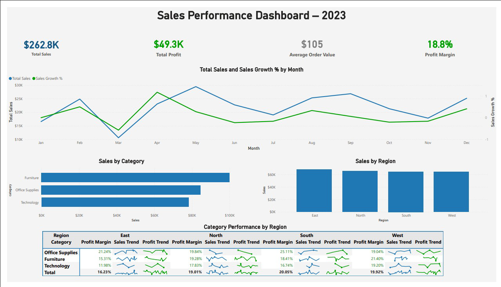

# Sales Performance Dashboard – 2023

This project demonstrates an end-to-end data pipeline and dashboard using **PySpark** for data cleaning and **Power BI** for visualization.

## Steps
1. **Data Cleaning with PySpark**
   - Standardized column names
   - Converted data types (int, double, date)
   - Removed nulls and duplicates
   - Exported cleaned dataset

2. **Data Visualization with Power BI**
   - Key KPIs: Total Sales, Total Profit, Average Order Value, Profit Margin
   - Trend Analysis: Sales & Sales Growth % by Month
   - Category & Region breakdowns
   - Matrix with sparklines for detailed category-region performance

## Final Dashboard


## How to Run
1. Clone this repo:
   ```bash
   git clone https://github.com/panwarnalini-hub/sales-performance-dashboard.git
